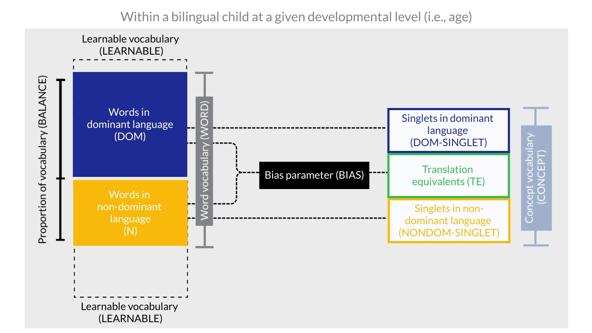

```{r load_packages_settings, include = FALSE}
library(rmarkdown)
library(knitr)
library(papaja)
library(kableExtra)
library(english)
library(here)
library(tidyverse)
library(tidylog)
library(wordbankr)
library(ggplot2)
library(patchwork)
library(gridExtra)
library("ggpubr")
library(lme4)
library(lmerTest)
library(scales)

`%notin%` <- Negate(`%in%`)

knitr::opts_chunk$set(echo = FALSE, warning = FALSE, message = FALSE, cache = TRUE)

```

```{r load_data}
# read in the final cleaned keepers_data
keepers_ws_TE <- read.csv(here::here("data_keepers/keepers_ws_TE_final.csv"))
```

Bilingual children must learn words that take a different form in each of their languages, but share the same or highly similar meanings. For instance, to refer to the same crisp red-skinned fruit, an English–French bilingual child must use the word “apple” when speaking English, and the word _“pomme”_ when speaking French. These cross-language synonyms are known as translation equivalents (also called doublets; Umbel et al., 1992), and are observed amongst bilingual children’s first words (e.g., David & Wei, 2008; De Houwer, Bornstein, & De Coster, 2006; Pearson et al., 1995). Translation equivalents are thought to hold a special status in a bilingual’s developing lexicon due to the strong overlap in their semantics. For example, studies with bilingual toddlers show that the associative semantic properties of a word in one language facilitate the activation of its translation equivalent (e.g., Bilson et al., 2015; Floccia et al., 2020; Jardak & Byers-Heinlein, 2019). That is, upon hearing the English word “apple”, the corresponding French word _“pomme”_ is more easily activated in bilinguals’ minds. In vocabulary acquisition, bilingual children must learn a first label for a referent ( a “singlet”; Umbel et al., 1992) before they can learn its translation equivalent. Is translation equivalent learning different from singlet learning? The current paper contrasts three competing accounts: 1) translation equivalents are hard to learn than singlets (Avoidance Account), 2) translation equivalents are easier to learn than singlets (Preference Account), and 3) translation equivalents are neither harder nor easier to learn than singlets (Neutral Account). To adjudicate between these accounts, we introduce the Bilingual Vocabulary Model as a computational account of vocabulary learning, with parameters including bilinguals’ vocabulary in each language and their developmental level. In Study 1, we use the Bilingual Vocabulary Model to derive a set of predictions, which we then test against vocabulary data from 200 18- to 33-month-old bilingual children in Study 2.

## Accounts of translation equivalent learning

### Avoidance Account: Translation equivalents are harder to learn than singlets
Early theories of bilingual development claimed that translation equivalents are conspicuously missing from bilingual children’s early vocabularies (e.g., Imedadze, 1978; Swain & Wesche 1975; Volterra & Taeschner, 1978). The phenomenon of missing translation equivalents led theorists to propose that young bilingual children do not differentiate their languages, and thus tend to learn only a single word for each referent. This avoidance of translation equivalents was thought to be due to word learning biases such as mutual exclusivity, whereby children assume that a referent is only associated with one word at the basic level (Markman & Wachtel, 1988; Markman, 1992; 1994). For example, when monolingual children see a familiar object (e.g., a cup) next to a novel object (e.g., a garlic press) and hear a novel word like “wug”, they assume that “wug” refers to the garlic press — the object unknown to them — rather than to the cup, the object for which they already know the word.

Although mutual exclusivity is helpful for monolingual vocabulary acquisition, its use is more complex for bilingual vocabulary acquisition (Byers-Heinlein & Werker, 2009; Davidson & Tell, 2005; Houston-Price, Caloghiris, & Raviglione, 2010). When encountering a potential singlet, mutual exclusivity would be equally useful for bilinguals as it is for monolinguals, supporting them in associating an unlabeled referent with a novel word. However, a strong form of mutual exclusivity might prevent bilinguals from associating a translation equivalent word with its referent, given that in this case the referent is already associated with another word (albeit in the other language). Thus, mutual exclusivity could prevent bilinguals from acquiring translation equivalents, leading to an abundance of singlets in their vocabularies.

Contrary to earlier studies, more recent work has indicated that bilinguals do understand and produce translation equivalents from early in development (David & Wei, 2008; De Houwer et al., 2006; Holowka et al., 2002; Pearson et al., 1995; Legacy et al., 2017). Indeed, experimental work has suggested bilingual experience in infancy might not support the development of one-to-one mapping biases such as mutual exclusivity, at least in early infancy. For example, when hearing a novel word like “nil”, monolingual children aged 17–22 months looked towards a novel object rather than a familiar object, but bi- and multilingual children looked similarly to both objects (Byers-Heinlein & Werker, 2009; 2013; Houston-Price et al., 2010). A recent meta-analysis also indicated that bilingual children show mutual exclusivity to a weaker degree than monolinguals (Lewis et al, 2020). 

Overall, converging evidence refutes the position that a strong form of mutual exclusivity operates on the developing bilingual lexicon to prevent bilinguals from acquiring translation equivalents. Nonetheless, it leaves open the possibility that translation equivalents may be less likely acquired in favour of learning singlets even if translation equivalents are not completely avoided. If bilingual children avoid lexical overlap across languages even to a small degree, then under the Avoidance Account translation equivalents would be harder to learn than singlets. 

### Preference Account: Translation equivalents are easier to learn than singlets
Contrary to the Avoidance Account, the Preference Account posits that translation equivalents are easier to learn than singlets. At a minimum, word learning requires encoding and representing the relevant sounds of a word, creating a mental representation of its referent, and linking the two. When a French–English bilingual child encounters the word _“pomme”_ after having learned “apple”, one part of that process has already occurred in that the referent is already represented; because part of the word learning task is already accomplished, translation equivalents might therefore be easier to learn (e.g., Montanari, 2010; Poulin-Dubois et al., 2013; 2017). Moreover, research suggests that bilingual lexicons are not tightly encapsulated by language, but instead include cross-language mental links between words that are semantically related (e.g., Floccia et al., 2020; Jardak & Byers-Heinlein, 2018; Singh, 2013). In this context, the strong semantic overlap makes translation equivalents special, and could facilitate their acquisition (e.g., Bilson et al., 2015; Floccia et al., 2020). The Preference Account predicts that translation equivalents would be more easily learned than singlets. 

There are several lines of empirical evidence to support the Preference Account. For example, some early case studies reported that bilinguals tended to learn more translation equivalents than singlets when experiencing a shift in their language exposure that inverted their dominant and non-dominant languages (Lanvers, 1999; Pearson & Fernández, 1994). The main explanation that has been given for this finding is that additional exposure to their non-dominant language — which became their new dominant language — enabled fast mapping of words to already-lexicalized concepts. 

Other evidence suggesting translation equivalents might be easier to learn than singlets comes from a study that included vocabulary-checklist data from 254 monolingual and 181 bilingual children aged 6 months to 7.5 years (Bilson et al., 2015). The researchers used a network analysis approach to investigate how translation equivalents are learned, focusing on the semantic relationships between the words (e.g., words like “cat” and “dog” are strongly semantically related). Using a statistical model that allowed free semantic relations among vocabulary data from monolingual and bilingual children, the results suggested that words were learned faster when they were semantically connected to more known words in the lexicons. This effect applied not only to words within the same language, but also to words across languages including translation equivalents (e.g., English “dog” and French _“chien”_) and words that had other cross-language relations (e.g., “cat” and _“chien”_). The authors then simulated bilingual vocabulaires by modeling bilingual lexicons as combinations of two independent vocabulary-size-matched monolinguals. Comparison with actual bilingual children’s vocabulary data revealed that bilingual children acquired more translation equivalents than predicted by the simulation. The authors therefore concluded that bilingual children show a preference for learning translation equivalents over singlets. Note that, in their study, translation equivalent knowledge was simulated based on the number of lexical items that overlapped between two randomly chosen English monolinguals (e.g., whether both monolinguals knew the word “cat”). However, it is unclear whether this is an appropriate point of comparison for bilingual children as this approach may overlook variables that impact bilinguals’ vocabulary learning including vocabulary size in each language and the developmental level of a child — an issue that we will return to later in the introduction.

Overall, there is some evidence that bilingual children more readily learn translation equivalents than singlets. If the strong semantic overlap between translation equivalents facilitates their learning, then under the Preference Account translation equivalents would be more easily learned than singlets.

### Neutral Account: Translation equivalents are similar to learn than singlets
The previous accounts rely on the idea that bilingual vocabulary development unfolds differently than monolingual development, as monolinguals encounter only singlets but bilinguals encounter both singlets and translation equivalents. There is an underlying assumption that translation equivalent learning is somehow special relative to singlet learning — the Avoidance Account proposes that translation equivalents are harder to learn than singlets, whereas the Preference Account proposes that translation equivalents are easier to learn than singlets. However, it is also possible that translation equivalents are neither harder nor easier to learn than singlets. We call this the Neutral Account.

The Neutral Account implies that bilingual children’s two languages develop relatively independently. Indeed, language and processing measures in bilinguals tend to be tightly correlated within a particular language, with only weak cross-language correlations. For example, 30-month-old bilingual children’s processing efficiency in a particular language closely correlated with vocabulary size in that language, but was unrelated to vocabulary size in their other language (Marchman, Fernald, & Hurtado, 2010). Due to differences in the amount of language exposure, bilingual children seldom show equal vocabulary growth in both of their languages (e.g., Pearson & Fernández, 1994; Pearson et al., 1997), and the amount of exposure to a particular language has been reported to modulate the within-language association between language processing ability and vocabulary size (Hurtado et al., 2013). Bilingual children who heard a greater amount of a particular language tended to process that language faster, and in turn learned more words in that language. 

In a study whose results directly support the Neutral Account, Pearson and colleagues (1995) randomly paired the single-language English lexicons from a subset of bilingual children to the single-language Spanish lexicons from another subset of bilingual children to derive a percentage of by-chance lexical overlaps shared between monolingual lexicons of two randomly paired children. It was revealed that the percentage of translation equivalents observed in English–Spanish bilingual children was similar to the by-chance percentage of translation equivalents between randomly-paired children. This evidence suggested that the acquisition of translation equivalents is not that different from the expected overlap between two independent lexicons, implying that singlets and translation equivalents are equally learnable. In sum, the Neutral Account predicts that translation equivalents are neither harder nor easier for bilingual children to learn than singlets.

## Contributors to translation equivalent knowledge
The previous section discussed three theoretical accounts concerning the relative learnability of translation equivalents. However, to date, aspects of translation equivalent learning have mostly been examined in isolation, rather than as an integrated system. In this section, we consider two proximal variables that we expect to predict the number of translation equivalents children know: vocabulary size in each language, and word learnability as a function of children’s developmental level.

### Vocabulary size in bilinguals’ two languages
Because translation equivalents are words from different languages that refer to the same concept, the number of words a bilingual knows in each of their languages will necessarily constrain the number of translation equivalent pairs they could possibly know. For example, a child with a less balanced vocabulary across the two languages might only say 5 words in one language but many more words in the other language; this means that the child could only produce a maximum of 5 translation equivalents, regardless of how many words they know in their other language. Conversely, it seems reasonable to expect that if a child knows a similar number of words in each language and thus has a more balanced vocabulary across the two languages, there would be more potential for some of those words to be translation equivalents.

Balance between the two vocabulary sizes is a function of the number of words bilingual children produce in each language, which appears to be tightly linked to their exposure to each language. In general, more language exposure leads to larger vocabulary size (e.g., Barnes & Garcia, 2012; Boyce et al., 2013; Hurtado et al., 2013; Marchman, Fernald, & Hurtado, 2010; Place & Hoff, 2011; Pearson et al., 1997). Bilingual children tend to know more words in the language in which they have greater exposure (i.e; dominant language) relative to the language in which they have less exposure (i.e., non-dominant language; Pearson et al., 1997; Place & Hoff, 2011). This is because the more often a bilingual hears a language, the more opportunities there will be for learning new words in that language.

One important consideration in thinking about bilingual children’s experience is whether they encounter and use their languages within the same or different contexts. This is known as the Complementarity Principle (Grosjean, 2016). For example, for school-aged bilinguals, school-related words are more likely to be known in the language of schooling rather than in the home language (Bialystok et al., 2010). If certain words are encountered in particular contexts where only one language is used, bilinguals may have fewer opportunities to learn translation equivalents for these words. However, the Complementarity Principle may not necessarily impact bilingual word acquisition in infancy. Most words in children’s early vocabularies could be considered “home words”, which include words for social and daily routines (“hello”, “more”, “diaper”), common nouns (“doggie”), and everyday verbs (“walk”). Such words are likely to be encountered across contexts where children spend the majority of their time, such as at home and at childcare. Thus, growing up in a bilingual context from birth, bilingual children presumably encounter “home words” in both languages. Accordingly, we assume that for the most part, bilingual children’s opportunities for learning words in each of their languages will be proportional to their overall exposure to the language, and largely not subject to the Complementarity Principle. We further consider implications of this assumption in the discussion section.

Finally, we must note that vocabulary acquisition is not solely tied to quantity of input, but is also predicted by a host of other factors such as children’s ability to segment words from the continuous stream of speech (e.g., Brent & Siskind, 2001; Swingley & Humphrey, 2018), children’s efficiency of processing words they hear (e.g., Hurtado et al., 2013; Weisleder & Fernald, 2013), cognitive development and perceptual bias (e.g., Benedict ,1979; Goodman et al., 2008), and family socioeconomic status (Fernald, Marchman, & Weisleder, 2013). Nonetheless, all else being equal, words that are encountered more frequently are acquired sooner than those encountered less frequently (Brent & Siskind, 2001; Goodman et al., 2008; Swingley & Humphrey, 2018). 

### Word learnability as a function of developmental level
An often overlooked factor that could contribute to bilingual children’s learning of translation equivalents is related to the changes in the learnability of different words over time based on children’s developmental level. Evidence from monolingual children shows that some types of words are characteristically learned before others. For example, across many languages, including English, children show a noun bias in their early lexicons (Braginsky et al., 2019; Goodman et al., 2008), although for other languages such as Mandarin it appears that verbs and nouns are more equally acquired (Tardif, 1996). Certain classes of words are rarely known at the onset of lexical development, such as prepositions and words for time (Fenson et al., 2007). This is thought to be due to the cognitive and linguistic machinery that must be in place in order for children to represent these concepts, a necessary prerequisite for learning certain word types (Bergelson, 2020; Braginsky et al., 2019). If this is the case, then children might be more likely to learn translation equivalents than singlets, simply because translation equivalents are more likely to be learnable at their stage of development. That is, potential singlets might be “too hard” to be learned at a particular age. Thus, a seeming overabundance of translation equivalents might be a product of developmental constraints on word learning, rather than due to semantic facilitation.

## The Bilingual Vocabulary Model
Taking into account the contributions of language exposure and developmental level to bilingual children’s vocabulary acquisition, we put forward the Bilingual Vocabulary Model. This model proposes that the number of translation equivalents that children produce is a function of vocabulary learning in each language, in the context of the number of potentially learnable words given the children’s developmental level. We formalize learning a translation equivalent pair  as the joint probability of learning each of the words in the pair. This provides a clear empirical test of different theoretical accounts of translation equivalent learning, by asking whether or not the probability of knowing a word is independent of knowing its translation equivalent. The logic is similar to that of the familiar chi-squared test for independence, where the independence of two events from the same population is tested as the probability of their intersection computed by multiplying the probability of each individual event: P(A and B) = P(A) × P(B | A) where P(B | A) = P(B) if A and B are independent (see Box 1 for a detailed example). The full model is shown in Figure 1. In the next paragraphs, we define each of the model parameters in detail, and these are also summarized in Table 1. 

&nbsp;

```{r box1, results="asis", fig.cap = " "}
box1 <- data.frame(title = "To test the independence of two events from the same population, as an example, we might ask whether Psychology majors are more likely to be left-handed. To determine independence, we must know the probability of being a psychology major, the probability of being left handed, and the probability of being both a psychology major and left-handed. The numerator of these probabilities will be the number of students who are left-handed, psychology majors, and both (respectively) and the denominator will be the total population of students we are observing. Imagine a college of 1000 students. If 100/1000 (or 1/10) students are left-handed, and 200/1000 (or 1/5) students are psychology majors, then if these variables are independent we expect a proportion of 1/10 × 1/5 = 1/50 students to be left-handed psychology majors. To determine the number we expect to observe in the college, we multiple 1/50 × 1000 = 20 students. When we compare this expected number to the actual number of left-handed students, there are three possible outcomes. First, we may observe many more than 20 left-handed psychology students at the college (say 100 students), which suggests that being left-handed increases the probability of majoring in psychology. Or, second, we may observe many fewer than 20 left-handed psychology students at the college (say 5 students), this suggests that being left-handed decreases the probability of majoring in psychology (in this example by a factor of 1/4). Finally, if left-handedness and majoring in psychology are independent, we can predict the number of left-handed psychology students by multiplying the observed number of left-handed students (100) by the observed number of psychology students (200), and dividing by the total population of the college (1000), so for example 100×200/1000 = 20. Thus, comparing expected and observed numbers can inform us about the independence of the underlying phenomena.") %>%
  rename("Box 1. Example of test for independence." = title)

kable(box1,
      format="latex", booktabs=TRUE, longtable = TRUE) %>%
  column_spec(1, width = "450px") %>%
  kable_styling(font_size = 10)

```

```{r fig1, fig.cap="Illustration of the Bilingual Vocabulary Model.", fig.align='center', out.width='100%'}


```

The model takes four main parameters: the number of words produced in the dominant language (DOM), the number of words produced in the non-dominant language (NONDOM), vocabulary size of potentially learnable words in each language (LEARNABLE), and a bias parameter (BIAS) which indicates whether the model is biased towards (BIAS > 1) or against (BIAS < 1) learning translation equivalents. The language in which a child knows more words is the dominant language, whereas the one in which a child knows fewer words is the non-dominant language. 
Next, we turn to the LEARNABLE parameter (i.e., the number of potentially learnable words). If DOM and NONDOM are measured with an instrument such as the MacArthur-Bates Communicative Development inventories (CDI; Fenson et al., 2007), one option would be to set LEARNABLE to be the total number of items on the CDI. For convenience, consider the effect of setting LEARNABLE to 600, as a round number (the actual number of CDI items is usually slightly higher than 600, depending on the language of the adaptation). Very young children would not be expected to know many of the “harder” words on the CDI, such as “lawn mower”, “sidewalk”, or “vitamins'', due to children’s immature cognitive machinery and conceptual development. A more reasonable solution might be to determine how many CDI words are potentially learnable given the child’s developmental level, which could be approximated by their age. For example, Jamie who is 18 months old produces 50 English words and 20 French words, thus a total of 70 words. Monolingual children his age with the very largest productive vocabularies (those at the 90th percentile averaging between English and French norms) produce a total of 245 words (retrieved from the Wordbank database; Frank et al., 2016). Although there is likely considerable individual variability as to the cognitive capacity even amongst children of the same age, we argue that this provides a reasonable — if imperfect — estimate of the number of learnable words (LEARNABLE) that a child of Jamie’s age could potentially acquire in each language. Thus, we might expect that Jamie could potentially have learned up to 245 English words and 245 French words, although he has thus far only learned 50 in English and 20 in French. 

Using the mathematical concept of independence, we can then quantify the number of translation equivalents (TE) expected given children’s vocabulary sizes in the dominant (DOM) and non-dominant (NONDOM) languages, as well as the number of potentially learnable words (LEARNABLE). If dominant-language and non-dominant-language words are learned independently from each other, we multiply DOM × NONDOM (the number of words known in the dominant and non-dominant language respectively), and divide by the total population of learnable words in one language (LEARNABLE) — which is the possible number of words that could overlap across both languages — to predict the number of translation equivalents. 
We further introduce the bias parameter (BIAS), which allows us to examine whether translation equivalent learning is best described by the Avoidance, Preference, or Neutral account. Adding this parameter, translation equivalents can be derived from TE = BIAS × (DOM × NONDOM)/LEARNABLE. For the Avoidance Account, BIAS will be less than 1, meaning that TEs are less easily learned than singlets; for the Preference Account, BIAS will be greater than 1, meaning that translation equivalents are more easily learned than singlets; for the the Neutral Account, BIAS is exactly 1 (i.e., the model is unbiased with respect to whether translation equivalents are more difficult or easier to acquire than singlets). Going back to the example of 18-month-old Jamie, we would set the denominator at 245 which is the number of potentially learnable words at 18 months. If translation equivalents are half as easy to learn as singlets (following the Avoidance Account), we would expect Jamie to produce .5×(50×20/245) = 2.0 translation equivalents. Conversely, if translation equivalents are twice as easy to learn as singlets (following the Preference Account), we would expect Jamie to produce 2×(50×20/245) = 8.2 translation equivalents. Under the Neutral Account, we would expect Jamie to learn 1×(50×20/245) = 4.1 translation equivalents. 

Finally, based on the main parameters, we can calculate additional, commonly-reported descriptors of bilingual vocabulary, which we detail below and describe as derived parameters. 

Balance of vocabulary (BALANCE) is the proportion of total words that children produce in each language. For convenience, balance is defined in reference to the non-dominant language with the formula NONDOM/(DOM+NONDOM), such that scores can range from 0.0 (completely unbalanced) to 0.5 (completely balanced). For example, since 18-month-old Jamie produces 50 dominant vocabulary words and 20 non-dominant vocabulary words, he would have a balance score of 0.29. Note that this calculation does not take into account overlap in meaning across the two languages (i.e., how many words he produces are translation equivalents). 

Word vocabulary (WORD; sometimes called total productive vocabulary) is the total number of words that a child produces across the two languages, calculated as the sum of the dominant vocabulary (DOM) and non-dominant vocabulary (NONDOM). 
Concept vocabulary (CONCEPT; sometimes called total conceptual vocabulary) is the number of concepts that are lexicalized by the child — that is, the total number of concepts that are lexicalized in either language. This can be calculated by subtracting the number of translation equivalents (TE) from the word vocabulary (WORD). Finally, we can also calculate singlets that are produced in each language, that is words for which the child does not yet produce a translation equivalent. Singlets in the dominant language (DOM-SINGLET) can be calculated by subtracting translation equivalents (TE) from dominant-language vocabulary (DOM); singlets in the non-dominant language (NONDOM-SINGLET) can be calculated by subtracting translation equivalents (TE) from non-dominant language vocabulary (NONDOM). It is also possible to decompose children’s word vocabulary (WORD) into the sum of TE, DOM-SINGLET, and NONDOM-SINGLET.

```{r table1, results = "asis"}

table1 <- data.frame(
  Variable = c("LEARNABLE", "DOM", "NONDOM", "BIAS", "BALANCE", "WORD", "TE", "CONCEPT", "DOM-SINGLET", "NONDOM-SINGLET"),
  Definition = c("Number of learnable words in each language, given the child’s developmental level",
                   "Words produced in the dominant language",
                   "Words produced in the non-dominant language",
                   "Bias parameter",
                   "Balance (relative proportion of words produced in the non-dominant language to the total words produced in both languages)",
                   "Word vocabulary (or total vocabulary size)",
                   "Translation equivalents produced",
                   "Concept vocabulary (or total conceptual vocabulary size)",
                   "Singlets in dominant language",
                   "Singlets in non-dominant language"),
  Constraints = c("Varies by age. No greater than the number of words on CDI.",
                  "DOM \u2265 NONDOM (i.e., always produce more words in dominant than non-dominant language); DOM \u2264 LEARNABLE",
                  "NONDOM \u2264 DOM (always produce fewer words in non-dominant than dominant language); NONDOM \u2264 LEARNABLE",
                  "BIAS < 1 implies the Avoidance Account; BIAS > 1 implies the Preference Account; BIAS = 1 implies the Neutral Account",
                  ".00 \u2264 BALANCE \u2264 .50 (greater values indicate children producing a more similar number of words in their two languages)",
                  "W \u2264 2LEARNABLE (maximum word vocabulary is knowing each word in both languages)",
                  "", "", "", ""),
  "Relationship to other parameters" = c("Maximum number that could be learned in DOM or NONDOM",
                                         "DOM = (1-BALANCE)×WORD; DOM = WORD - NONDOM",
                                         "NONDOM = BALANCE×WORD; NONDOM = WORD - DOM",
                                         "Account = BIAS×(DOM×NONDOM/LEARNABLE)",
                                         "BALANCE = NONDOM/WORD; BALANCE = NONDOM/(DOM+NONDOM)",
                                         "WORD = DOM+NONDOM; WORD = DOM/(1-BALANCE); WORD = NONDOM/(BALANCE)",
                                         "If DOM and NONDOM are independent, TE = DOM×NONDOM/LEARNABLE",
                                         "CONCEPT = WORD - TE; CONCEPT = TE + DOM-SINGLET + NONDOM-SINGLET",
                                         "DOM-SINGLET = DOM - TE",
                                         "NONDOM_SINGLET = NONCOM - TE")
) 

landscape(
  kable(table1,
        format = "latex", booktabs = TRUE,
        caption = "Summary of the parameters in the Bilingual Vocabulary Model.") %>%
    kableExtra::kable_styling(font_size = 7) %>%
    pack_rows("Main Parameters", 1, 4) %>%
    pack_rows("Derived Parameters", 5, 10) %>%
    column_spec(2:4, width = "175px")
)
```

## Current research
The current research aimed to better understand the nature of translation equivalent learning in bilingual children. Study 1 simulated the expected patterns of translation equivalent learning under the Bilingual Vocabulary Model proposed in the introduction, with reference to the proportion of words learned in the dominant and non-dominant language and the number of words that are learnable at various developmental levels. We also compared predicted learning outcomes for when translation equivalents are harder to learn, or easier to learn, or similar to learn than singlets. 

In Study 2, we examined real-world translation equivalent development in light of the predictions from the Bilingual Vocabulary Model, using archival data from 200 French–English bilingual children aged 18 to 33 months, whose vocabularies and translation equivalent knowledge were measured by parent report using the MacArthur-Bates CDI: Words and Sentences form in English (Fenson et al., 2007) and Québec French (Trudeau et al., 1997). Together, the Bilingual Vocabulary Model and real-world data allowed us to examine contrasting hypotheses about translation equivalents: whether translation equivalents learning is harder (Avoidance Account), whether translation equivalent learning is easier (Preference Account), or similar to learn than singlets (Neutral Account).

# Study 1: Simulations
Study 1 provides a computational implementation of the Bilingual Vocabulary Model outlined in the introduction (see also Figure 1), which we use to simulate different scenarios to examine the effect of vocabulary sizes and developmental variables on translation equivalent learning. Note that usually only three values are necessary to calculate all the other variables (see Table 1). Most commonly, we can calculate other variables based on the total number of learnable words (LEARNABLE) together with either the words known in each language (DOM and NONDOM) or word vocabulary plus balance (WORD and BALANCE) which allow us to compute DOM and NONDOM. It is also possible to calculate other variables based on the total number of learnable words (LEARNABLE) with balance and words known in either language (BALANCE and DOM or BALANCE and NONDOM).

Three simulations were generated to explore expected patterns of translation equivalent learning under the Bilingual Vocabulary Model. In the first simulation, we examined how translation equivalent learning relates to vocabulary balance (BALANCE), as well as different metrics of vocabulary size, including dominant-language vocabulary (DOM), non-dominant language vocabulary (NON-DOM), and word vocabulary (WORD). In the second simulation, we explored relationships between translation equivalents (TE), balance (BALANCE), and learnable words (LEARNABLE). In the first two simulations, the BIAS parameter was held constant at 1 (Neutral Account); in the third simulation, we varied the bias parameter (BIAS) to compare translation equivalent learning under the Avoidance, Preference, and Neutral Accounts. A summary of the parameter values used in each simulation is provided in Table 2.

```{r table2, results = "asis"}

table2 <- data.frame(
  Simulation = c("1", "2", "3"),
  LEARNABLE = c("Constant at 600", "Varied at 300, 450, and 600", "Varied at 150, 300, 450, and 600"),
  DOM = c("Varied, ranging from 100 to LEARNABLE at an interval of 100", 
          "Varied, ranging from 100 to LEARNABLE at an interval of 100",
          "Varied, ranging from 100 to LEARNABLE at an interval of 100 "),
  NONDOM = c("Varied, ranging from 0 to DOM at an interval of 10",
             "Varied, ranging from 0 to DOM at an interval of 25",
             "Varied, ranging from 0 to DOM at an interval of 25"),
  WORD = c("Calculated as WORD = DOM + NONDOM",
           "Calculated as WORD = DOM + NONDOM",
           "Calculated as WORD = DOM + NONDOM"),
  BALANCE = c("Calculated as BALANCE = NONDOM / (DOM+NONDOM)",
              "Calculated as BALANCE = NONDOM / (DOM+NONDOM)",
              "Calculated as BALANCE = NONDOM / (DOM+NONDOM)"),
  BIAS = c("Constant at 1", "Constant at 1", 
           "Varied at 0.5 (Avoidance Account), \n 1 (Neutral Account), \n and 1.5 (Preference Account)"),
  n_data = c(216, 161, 166)
) 

landscape(
  kable(table2,
        col.names = c("Simulation",
                      "Learnable words (LEARNABLE)",
                      "Words in dominant Language (DOM)",
                      "Words in non-dominant language (NONDOM)",
                      "Word vocabulary (WORD)",
                      "Balance of vocabulary (BALANCE)",
                      "Bias parameter (BIAS)",
                      "Total number of data points generated"),
        align = "clllllll",
        format="latex", booktabs = TRUE,
        caption = "Summary of the parameters used in each simulation.") %>%
    column_spec(1:2, width = "45px") %>%
    column_spec(3:7, width = "75px") %>%
    column_spec(8, width = "45px") %>%
    kable_styling(font_size = 8)
)
  
```

## Simulation 1: Children of the same developmental level with different word vocabularies and balances of vocabulary
In Simulation 1, we first illustrate the mathematical relationships between different variables in the model by simulating three hypothetical children who are at the same developmental level and thus have the same number of potentially learnable words (LEARNABLE), but with different word vocabularies (WORD) and BALANCE. For convenience, we set LEARNABLE = 600 in this example, which roughly corresponds to what is expected for an English-learning 26 month-old (i.e., the most verbal 26-month-old English-learner at the 90th percentile of vocabulary produces around 600 words as retrieved from the Wordbank database; Frank et al., 2016). We set BIAS to 1, meaning that in these examples translation equivalents are similarly easy to learn as singlets.

We first illustrate with three hypothetical children. Infant Annie (small vocabulary, unbalanced exposure) produces 270 words in the dominant language and 30 words in her non-dominant language. She has a word vocabulary of 300, and a balance score of .10 (10% of her words are in the non-dominant language). Based on the formula TE = DOM×NONDOM/LEARNABLE (we drop BIAS from the formula since it is 1 here) and as seen in Table 3, Annie is expected to produce 13.5 translation equivalents. Infant Bernie (small vocabulary, balanced exposure) produces 180 dominant-language words, and 120 non-dominant language words. Like Annie, he has a word vocabulary of 300, but he has a higher balance score of .40 (40% of his words are in the non-dominant language). Based on our formula, we expect Bernie to produce 36 translation equivalents. Comparing Annie and Bernie, two children who produce the same word vocabulary (i.e., WORD is held constant), the child with more balanced language vocabulary (Bernie) is expected to produce more translation equivalents. Like Bernie, infant Charlie also has a balanced vocabulary, but has a larger word vocabulary (WORD), producing 540 words in the dominant language (DOM) and 360 in the non-dominant language (NONDOM) for a total of 900 words (WORD), and thus BALANCE = .40. Based on our formula for Simulation 1, we expect Charlie to produce 324 translation equivalents (TE). Infants Bernie and Charlie illustrate that for two children equal in BALANCE, the child with larger word vocabulary (WORD) is expected to produce more translation equivalents (TE). Other vocabulary metrics are calculated for each hypothetical child as described in Table 3.


```{r table3, results="asis"}

# create columns that contain information to be added to table3 in the next step
## Definition column: the definition of each variable in the table
Definition <- c("Bias parameter", "Learnable words", "Words produced in the dominant language", "Words produced in the non-dominant language",
                "Word vocabulary (or total vocabulary size)", "Vocabulary balance", "Translation equivalents produced", 
                "Concept vocabulary (or total conceptual vocabulary size)", "Singlets in dominant language", "Singlets in non-dominant language")
## Calculation column: the formula used to calculate the derived parameters
Calculation <- c("", "", "", "", 
                 "DOM + NONDOM", "NONDOM / (DOM + NONDOM)", "DOM * NONDOM / LEARNABLE", "WORD - TE", "DOM - TE", "NONDOM - TE")

table3 <- data.frame(
    # define the main parameters
    hypotheical_child = c("Infant Anne (small vocabulary, unbalanced)",
                        "Infant Bernie (small vocabulary, balanced)",
                        "Infant Charlie (large vocabulary, balanced)"),
    BIAS = 1, 
    LEARNABLE = 600, 
    DOM = c(270, 180, 540),
    NONDOM = c(30, 120, 360)
  ) %>%
  # calculate the derived parameters from the main parameters
  mutate(WORD = DOM + NONDOM,
         BALANCE = NONDOM/(DOM+NONDOM),
         TE = DOM*NONDOM/LEARNABLE,
         CONCEPT = WORD - TE,
         "DOM-SINGLET" = DOM - TE, 
         "NONDOM-SINGLET" = NONDOM - TE) %>%
  # transpose the data set for presentation
  pivot_longer(-("hypotheical_child"), names_to = "Variable", values_to = "value") %>%
  pivot_wider(names_from = "hypotheical_child", values_from = "value") %>%
  # append other information for presentation
  mutate(Definition = Definition, 
         Calculation = Calculation) %>%
  # reorder columns
  relocate(c(Definition, Calculation), .before = "Infant Anne (small vocabulary, unbalanced)")
  
landscape(
  kable(table3,
      align = "llllll",
      format="latex", booktabs = TRUE,
      caption = "Examples for Simulation 1 of three hypothetical children with different hypothetical word vocabularies (WORD) and vocabulary balance (BALANCE), where the number of learnable words (LEARNABLE) = 600 and BIAS = 1.") %>%
  pack_rows("Main Parameters", 1, 4) %>%
  pack_rows("Derived Parameters", 5, 10) %>%
  column_spec(c(1), width = "100px") %>%
  column_spec(c(2:3), width = "140px") %>%
  column_spec(c(4:6), width = "60px") %>%
  kable_styling(font_size = 8) 
)

```

We then broadened this simulation to the more general case and examined patterns of translation equivalent learning, where simulated children had the capacity to learn 600 words (LEARNABLE held constant at 600), and their vocabulary size in each language (DOM and NONDOM) varied. Data from a total of 216 simulated children were generated (see Table 2 for a summary of the parameter values used in this simulation). Based on these values, we derived simulated children’s word vocabulary (WORD, calculated as DOM+NONDOM) and their vocabulary balance (BALANCE, calculated as NONDOM/(DOM+NONDOM)). In Figure 2, we plotted TE knowledge as predicted by DOM, NONDOM, and WORD at different levels of BALANCE. Across all three Panels (1A, 1B, and 1C), children with the most balanced vocabulary consistently produce more translation equivalents than other children. Moreover, Panels 1A and 1C show that, as the number of DOM (dominant language words) and WORD (word vocabulary) increase, the number of TE also increases regardless of BALANCE. Interestingly, Panel 1B shows that NONDOM and TE are extremely tightly coupled. In sum, we observe three important patterns, which will serve as Prediction Set 1 from the Bilingual Vocabulary Model for Study 2: 

* Prediction 1a: Children with more balanced vocabularies (BALANCE) will produce more translation equivalents (TE). 
* Prediction 1b: Children who produce more dominant-language words (DOM) or more total words (WORD) will produce more translation equivalents (TE). 
* Prediction 1c: Children who produce more non-dominant language words (NONDOM) will produce more translation equivalents (TE); but unlike for WORD and DOM this does not interact with BALANCE; instead, non-dominant vocabulary size will be an almost perfect predictor of translation equivalent knowledge(see panel 1B of Figure 2).

```{r simulation1, echo = FALSE}
# Simulation 1: simulating infants of the same developmental level with different word vocabularies and balances of exposure (LEARNABLE = 600)

## generate the simulation data
simulation1 <- function (LEARNABLE) {
  DOM_seq <- seq(100, LEARNABLE, by = 100) # sequence of D from 100 to V at an interval of 100
  NONDOM_seq <- seq(0, LEARNABLE, by = 10) # sequence of N from 0 to V at an interval of 10
  DOM <- rep (DOM_seq, length(NONDOM_seq))
  NONDOM <- rep(NONDOM_seq, length(DOM_seq))
  data_simulation1 <<- data.frame(LEARNABLE, DOM, NONDOM)
}

simulation1(600) # setting V = 600

## clean the simulation data
data_simulation1 <- data_simulation1 %>%
  arrange(DOM, NONDOM) %>%
  filter(NONDOM <= DOM) %>%
  # Get word vocabulary W
  mutate(WORD = DOM + NONDOM) %>%
  # Create other variables
  mutate(BALANCE = NONDOM/(DOM+NONDOM), 
         TE = (DOM*NONDOM)/LEARNABLE) %>% # If DOM and NONDOM are independent, TE = DOM*NONDOM/LEARNABLE
  # Round to keep whole numbers only
  mutate_at(vars(-BALANCE), round, 0) %>%
  # bin B into 5 groups
  mutate(bin_BALANCE = cut(BALANCE, breaks = c(0, 0.1, 0.2, 0.3, 0.4, 0.5), include.lowest=T,
                     labels = c("0.1", "0.2", "0.3", "0.4", "0.5"))) %>%
  arrange(DOM, NONDOM, bin_BALANCE)

## visualizing Simulation 1
simulation1 <- data_simulation1 %>%
  # convert to long data
  pivot_longer(c(WORD, DOM, NONDOM), names_to = "vocab_type", values_to = "number") %>%
  mutate(vocab_type = factor(vocab_type, levels=c("DOM", "NONDOM", "WORD"))) %>%
  mutate(vocab_type = recode(vocab_type, 
                             DOM = "Panel 1A: \n Dominant vocabulary \n (DOM)", 
                             NONDOM = "Panel 1B: \n Non-dominant vocabulary \n (NONDOM)",
                             WORD = "Panel 1C: \n Total vocabulary \n (WORD)")) %>%
  ggplot(aes(x = number, y = TE, color = bin_BALANCE, linetype = bin_BALANCE)) +
  stat_smooth(method = lm, se = F) +
  scale_color_manual(values=c("#bdbdbd", "#737373", "#525252", "#252525", "#000000")) + 
  scale_linetype_manual(values=c("longdash", "dotdash", "dashed", "twodash", "solid")) +
  theme_minimal() + 
  facet_grid(. ~ vocab_type) +
  theme(axis.text.x = element_text(angle = 90),
        legend.position = "bottom",
        plot.title = element_text(face = 'bold', size = 12, hjust = 0, vjust = 2),
        plot.title.position = "plot",
        text = element_text(size=12),
        panel.spacing.x = unit(2, "lines"),
        panel.background = element_rect(fill = NA, color = "black")) +
  ylim(0, 600) +
  xlim(0, 1000) +
  labs(x = "Number of words", 
       y = "Number of translation equivalents (TE)", 
       color = "Vocabulary balance (BALANCE)",
       linetype = "Vocabulary balance (BALANCE)",
       title = "1) Simulated data") +
  guides(color = guide_legend(reverse = T, nrow = 1),
         linetype = guide_legend(reverse = T, nrow = 1)) 
```

```{r simulation1-plus_observed_data, echo = FALSE}
Observed_plot_inputs_TE <- keepers_ws_TE %>% 
  select(baby_id, ID_testdate, age_days, number_of_te, word_vocab, total_words_dom, total_words_nondom, balance_vocab) %>%
  pivot_longer(c(word_vocab, total_words_dom, total_words_nondom), names_to = "vocab_type", values_to = "number") %>%
  mutate(vocab_type = factor(vocab_type, levels=c("total_words_dom", "total_words_nondom", "word_vocab"))) %>%
  mutate(vocab_type = recode(vocab_type, 
                             total_words_dom = "Panel 2A: \n Dominant vocabulary \n (DOM)", 
                             total_words_nondom = "Panel 2B:\n Non-dominant vocabulary \n (NONDOM)",
                             word_vocab = "Panel 2C: \n Total vocabulary \n (WORD)")) %>%
  mutate(bin_BALANCE = cut(balance_vocab, breaks = c(0, 0.1, 0.2, 0.3, 0.4, 0.5), include.lowest=T,
                     labels = c("0.1", "0.2", "0.3", "0.4", "0.5"))) %>%
  ggplot(aes(x = number, y = number_of_te, color = bin_BALANCE, linetype = bin_BALANCE)) +
  #geom_point() +
  stat_smooth(method = lm, se = F) +
  scale_color_manual(values=c("#bdbdbd", "#737373", "#525252", "#252525", "#000000")) + 
  scale_linetype_manual(values=c("longdash", "dotdash", "dashed", "twodash", "solid")) + 
  theme_minimal() + 
  facet_grid(. ~ vocab_type) +
  theme(axis.text.x = element_text(angle = 90),
        plot.title = element_text(face = 'bold', size = 12, hjust = 0, vjust = 2),
        plot.title.position = "plot",
        text = element_text(size=12),
        legend.position = "bottom",
        panel.spacing.x = unit(2, "lines"),
        panel.background = element_rect(fill = NA, color = "black")) +
  ylim(0, 600) +
  xlim(0, 1000) +
  labs(x = "Number of words", 
       y = "Number of translation equivalents (TE)", 
       color = "Vocabulary balance (BALANCE)",
       linetype = "Vocabulary balance (BALANCE)",
       title = "2) Observed data") +
  guides(colour = guide_legend(reverse = T, nrow = 1),
         linetype = guide_legend(reverse = T, nrow = 1))

# combine Simulation1 visualization + observed data visualization
plot_Simulation1plusData <- ggarrange(simulation1, 
                                      Observed_plot_inputs_TE,
                                      nrow = 2,
                                      common.legend = TRUE, legend = "bottom")
```

```{r fig2, fig.cap="Number of translation equivalents (TE) across different levels of vocabulary balance (BALANCE) in relation to total dominant vocabulary size (DOM; Panel A), total non-dominant vocabulary size (NONDOM; Panel B), and total word vocabulary (WORD; Panel C). Row 1 represents the simulated data in Study 1 while holding the number of learnable words (LEARNABLE) constant at 600. Row 2 represents the observed vocabulary data in Study 2.", echo=FALSE, dpi=600, fig.align='center', fig.height=7, out.height="80%", out.width="110%"}

plot_Simulation1plusData
```


## Simulation 2: Acquisition of translation equivalents and singlets at different developmental levels
In our previous simulation, we assumed that each simulated child was at the same developmental level and had the capacity to learn the word for 600 different concepts (i.e., LEARNABLE held constant at 600). As laid out in the introduction, in the Bilingual Vocabulary Model the learnability of different words changes over time, where the possible number of words that can be learned increases as a child grows older. Therefore, in Simulation 2, we looked at the expected patterns of translation equivalent learning across varying levels of LEARNABLE (i.e., the number of learnable words as developmental level changes). Additionally, we further examined vocabulary composition by computing the number of singlets in the dominant (DOM-SINGLET) and non-dominant (NONDOM-SINGLET) language. BIAS was once again kept constant at 1.

Translation equivalent knowledge was simulated across children at three developmental levels (the number of LEARNABLE words = 300, 450, 600), in conjunction with a wide range of values for words in the dominant language (DOM) and the non-dominant language (NONDOM). In total, data from 161 simulated children were generated (see Table 2 for a summary of the parameters used in this simulation). Again, balance (BALANCE) was calculated based on the values of DOM and NONDOM with the formula NONDOM/(DOM+NONDOM). We also counted the number of singlet words in the dominant (DOM-SINGLET) and non-dominant (NONDOM-SINGLET) languages, so that simulated children’s concept vocabulary (CONCEPT) could be decomposed as the sum of TE (translation equivalents), DOM-SINGLET, and NONDOM-SINGLET. Figure 3 plots this decomposition for simulated children of different developmental levels, with vocabulary ranging from most balanced (BALANCE = .35 - .50), medium balanced (BALANCE = .20 - .35), and least balanced (BALANCE = .00 - .02).

In general, simulated children at a later developmental level had larger concept vocabularies (CONCEPT) as shown by the largest bars for the children at LEARNABLE = 600 compared to the shortest bars for children at LEARNABLE = 300. Moreover, we continue to observe a pattern reported in prediction 1a, whereby simulated children with more balanced vocabularies produced more translation equivalents (TE), as evidenced by the green bars that are the highest for the most balanced children (BALANCE = .36 - .50) compared to the medium balanced (BALANCE = .21 - .35) and the least balanced children (BALANCE = .00 - .20). Moreover, regardless of balance, simulated children at later developmental levels (i.e., older children with more potentially LEARNABLE words) acquired more translation equivalents. Across all three developmental levels of LEARNABLE, the light blue bars representing singlets in the dominant language (DOM-SINGLET) grow with less balanced exposure, whereas the dark blue bars representing singlets in the non-dominant language (NONDOM-SINGLET) grow with more balanced exposure. Overall, we observe 3 additional predictions (Prediction Set 2) made by the Bilingual Vocabulary Model. Compared to children at an earlier developmental level (i.e., younger infants with fewer potentially learnable words), children at a later developmental level (i.e., older infants with more potentially learnable words) will

* Prediction 2a: Have larger concept vocabularies (CONCEPT) 
* Prediction 2b: Produce more translation equivalents (TE), regardless of vocabulary balance (BALANCE).
* Prediction 2c: Produce more dominant-language singlet words (DOM-SINGLET). Moreover, those with a less balanced vocabulary (BALANCE) produce the most DOM-SINGLET.
* Prediction 2d: Produce more non-dominant-language singlets (NONDOM-SINGLET). Moreover, those with a more balanced vocabulary (BALANCE) produce the most NONDOM-SINGLET. 

```{r simulation2, echo = FALSE}
# Simulation 2: simulating patterns of translation equivalent learning as a function of different developmental timepoints (LEARNABLE = 300, 450, or 600)

## generate the simulation data
LEARNABLE <- seq(300, 600, by = 150) # set LEARNABLE to 300, 450, and 600

simulation2 <- function (LEARNABLE) {
  DOM_seq <- seq(100, LEARNABLE, by = 100) # sequence of D from 100 to V at an interval of 100
  NONDOM_seq <- seq(0, LEARNABLE, by = 25) # sequence of N from 0 to V at an interval of 25
  DOM <- rep(DOM_seq, length(NONDOM_seq))
  NONDOM <- rep(NONDOM_seq, length(DOM_seq))
  data_simulation2 <<- data.frame(LEARNABLE, DOM, NONDOM)
}

data_simulation2 <- do.call(rbind, lapply(LEARNABLE, simulation2)) %>%
  arrange(LEARNABLE, DOM, NONDOM) %>%
  filter(NONDOM <= DOM) %>%
  # Create other variables
  mutate(WORD = DOM + NONDOM, # word vocabulary 
         BALANCE = NONDOM/(DOM+NONDOM), # balance,
         TE = (DOM*NONDOM)/LEARNABLE, # If D and N are independent, TE = DN/V
         DOM_SINGLET = DOM-TE, # Unique words in dominant language
         NONDOM_SINGLET = NONDOM-TE) %>% # Unique words in non-dominant language
  # Round to keep whole numbers only
  mutate_at(vars(-BALANCE), round, 0) %>%
  # bin B into 3 groups
  mutate(bin_BALANCE = case_when(BALANCE >= 0.36 ~ "Most Balanced",
                                 BALANCE <= 0.20 ~ "Least Balanced",
                                 TRUE ~ "Medium Balanced")) %>%
  mutate(bin_BALANCE  = fct_rev(bin_BALANCE)) %>%
  arrange(DOM, NONDOM, bin_BALANCE)

## visualizing Simulation 2
simulation2 <- data_simulation2 %>%
  pivot_longer(-c(LEARNABLE, WORD, BALANCE, bin_BALANCE), names_to = "vocab_type", values_to = "number") %>%
  filter(vocab_type %notin% c("DOM", "NONDOM")) %>%
  mutate(vocab_type = factor(vocab_type, levels=c("NONDOM_SINGLET", "DOM_SINGLET", "TE"))) %>%
  mutate(LEARNABLE_label = case_when(LEARNABLE == 600 ~ "LEARNABLE = 600",
                                     LEARNABLE == 450 ~ "LEARNABLE = 450",
                                     LEARNABLE == 300 ~ "LEARNABLE = 300")) %>%
  group_by(LEARNABLE, LEARNABLE_label, bin_BALANCE, vocab_type) %>%
  summarise(n_words = mean(number)) %>%
  ggplot(aes(x = bin_BALANCE, y = n_words, fill = vocab_type)) + 
  geom_bar(position="stack", stat="identity") +
  facet_grid(. ~ LEARNABLE_label) +
  scale_fill_manual(values = c("#1f78b4", "#a6cee3", "#33a02c")) +
  scale_x_discrete(labels = function(bin_BALANCE) str_wrap(bin_BALANCE, width = 10)) + 
  ylim(0, 600) +
  theme_minimal() +
  theme(legend.position = "bottom",
        plot.title = element_text(face = 'bold', size = 12, hjust = 0, vjust = 2),
        plot.title.position = "plot",
        text = element_text(size=10),
        panel.spacing.x = unit(2, "lines")) + 
  labs(x = "\nVocabulary balance (BALANCE)", 
       y = "Number of concepts (CONCEPT)", 
       title = "Panel A: Simulated data")
```

```{r simulation2-plus_observed_data, echo = FALSE}
plot_stacked_byLEARNABLE <- keepers_ws_TE %>%
  select(baby_id, age_months_percentile, balance_vocab, word_vocab, number_of_te, total_singlet_dom, total_singlet_nondom) %>%
  # Subset developmental level (i.e., Average_90percentile) by 3 levels 
  mutate(LEARNABLE_subset = case_when(age_months_percentile <= 22 ~ "18-22 months \n (LEARNABLE = 244.9 - 451.9)",
                                      age_months_percentile > 22 & age_months_percentile <= 27 ~ "23-27 months \n (LEARNABLE = 491.8 - 604.1)",
                                      TRUE ~ "28-33 months \n (LEARNABLE = 620.4 - 638.9)")) %>%
  mutate(BalSubset = case_when(balance_vocab > 0.35 ~ "Most Balanced",
                               balance_vocab <= 0.20 ~ "Least Balanced",
                               TRUE ~ "Medium Balanced")) %>%
  mutate(BalSubset = fct_rev(BalSubset)) %>%
  arrange(desc(number_of_te)) %>%
  mutate(TE = number_of_te) %>%
  pivot_longer(-c(baby_id, age_months_percentile, balance_vocab, LEARNABLE_subset, BalSubset, word_vocab, TE), 
               names_to = "Type", values_to = "NumberOfWords") %>%
  mutate(Type = factor(Type, levels=c("total_singlet_nondom", "total_singlet_dom", "number_of_te"))) %>%
  mutate(Type = recode(Type, 
                       total_singlet_nondom = "Singlet in non-dominant language (NONDOM-SINGLET)", 
                       total_singlet_dom = "Singlet in dominant language (DOM-SINGLET)", 
                       number_of_te = "Translation equivalent (TE)")) %>%
  group_by(LEARNABLE_subset, BalSubset, Type) %>%
  summarise(n_words = mean(NumberOfWords)) %>%
  ggplot(aes(x = BalSubset, y = n_words, fill = Type)) +
  geom_bar(position="stack", stat="identity") +
  facet_grid(. ~ LEARNABLE_subset) +
  scale_fill_manual(values = c("#1f78b4", "#a6cee3", "#33a02c")) + 
  scale_x_discrete(labels = function(BalSubset) str_wrap(BalSubset, width = 10)) + 
  ylim(0, 600) +
  theme_minimal() +
  theme(axis.text.x = element_text(angle = 0) , 
        legend.position = "bottom",
        plot.title = element_text(face = 'bold', size = 12, hjust = 0, vjust = 2),
        plot.title.position = "plot",
        text = element_text(size=10),
        panel.spacing.x = unit(2, "lines")) + 
  guides(fill=guide_legend(nrow=3,byrow=TRUE)) + 
  labs(x = "\nVocabulary balance (BALANCE)", 
       y = "Number of concepts (CONCEPT)",
       title = "Panel B: Observed data") 

# combine Simulation2 visualization + observed data visualization
plot_Simulation2plusData <- ggarrange(simulation2 + rremove("legend"), 
                                      plot_stacked_byLEARNABLE,
                                      nrow = 2,
                                      heights=c(0.8,1))
```

```{r fig3, fig.cap="Number of translation equivalents (TE) and singlets in dominant (DOM-SINGLET) and non-dominant language (NONDOM-SINGLET) across different developmental levels/ages, which sets the number of LEARNABLE words. Panel A represents the model simulation in Study 1, where developmental levels of simulated children are set at three values: LEARNABLE = 300, 450, and 600. Panel B represents the observed vocabulary data in Study 2, where developmental level was divided into 3 subsets with children of 18-22 months (left), children of 23-27 months (middle), and children of 28-33 months (right). Proportion of balance (BALANCE) was divided into three groups, where the least balanced group had a range of .00 - .20 vocabulary balance, the medium balanced group had a range of .20 - .35, and the most balanced group had a range of .35 - .50.", echo=FALSE, dpi=600, fig.align='center', fig.height=7, out.height="80%", out.width="80%"}

plot_Simulation2plusData
```


## Simulation 3: Bias towards or against translation equivalent learning compared to singlets
In Simulations 1 and 2, we modeled cases in accordance to the Neutral Account where dominant-language and non-dominant language words were learned independently, such that the bias parameter (BIAS) was exactly 1 when we calculated TE as DOM×NONDOM/LEARNABLE. In our final simulation, we examined models where dominant-language and non-dominant language words were not independent, corresponding to the Avoidance Account and the Preference Account. Mathematically, this requires varying the BIAS parameter. For the Preference Account, BIAS will be greater than 1, meaning that TEs are more easily learned than singlets. On the other hand, for the Avoidance Account, BIAS will be less than 1, meaning that TEs are less easily learned than singlets. 

Translation equivalent knowledge was first simulated across different developmental levels (as indicated by number of LEARNABLE words = 150, 300, 450, 600), in conjunction with a wide range of values for DOM and NONDOM. Again, BALANCE and word vocabulary (WORD) were calculated based on the values of DOM and NONDOM. The final simulated data set contained 166 data points (see Table 2 for a summary of the parameters used). Three scenarios of translation equivalent learning (TE) were then generated using the formula TE = BIAS × DOM×NONDOM/LEARNABLE. To illustrate the Avoidance Account, BIAS was set at .5 (i.e., TEs are 50% less likely to be learned than singlets). To illustrate the Neutral Account, BIAS was set at 1 (i.e., TEs are neither easier nor harder to learn than singlets). Finally, to illustrate the Preference Account, BIAS was set at 1.5 (i.e., TE are 50% more likely to be learned than singlets). In Figure 4, we illustrate the three different scenarios of simulated translation equivalent knowledge. Again, we continue to observe a pattern consistent with prediction 1a where, in all cases, simulated children with more balanced vocabularies produced more translation equivalents. Thus, overall relationships between vocabulary balance and translation equivalent knowledge remained similar across the Avoidance, Preference, and Neutral Accounts. What changed is the slope of translation equivalent learning: the slopes were the shallowest under the Avoidance Account where BIAS = 0.5, whereas the slopes are steepest under the Preference Account where BIAS = 1.5. With this, we further outline Prediction Set 3: 

* Prediction 3: Whether translation equivalents are harder to learn, easier to learn, or similar to learn as singlets will change the slope of translation equivalent learning, with a shallower slope if TEs are less easily learned (i.e., Avoidance Account), and a steeper slope if TEs are more easily learned (i.e., Preference Account) compared to where translation equivalents are similar to learn as singlets (i.e., Neutral Account). 

```{r simulation3, echo = FALSE}
# Simulation 3: Non-independence of dominant-language (DOM) and non-dominant language words (NONDOM)

## generate the simulation data
LEARNABLE <- seq(150, 600, by = 150) # set LEARNABLE to 300, 450, and 600

simulation3 <- function (LEARNABLE) {
  DOM_seq = seq(100, LEARNABLE, by = 100) # sequence of DOM from 100 to LEARNABLE at an interval of 100
  NONDOM_seq = seq(0, LEARNABLE, by = 25) # sequence of NONDOM from 0 to LEARNABLE at an interval of 25
  DOM <- rep(DOM_seq, length(NONDOM_seq))
  NONDOM <- rep(NONDOM_seq, length(DOM_seq))
  data_simulation3 <<- data.frame(LEARNABLE, DOM, NONDOM)
}

data_simulation3 <- do.call(rbind, lapply(LEARNABLE, simulation3)) %>%
  arrange(LEARNABLE, DOM, NONDOM) %>%
  filter(NONDOM <= DOM) %>% # eliminate cases when NONDOM > DOM
  mutate(WORD = DOM+NONDOM, # word vocabulary
         BALANCE = NONDOM/(DOM+NONDOM), # balance 
         TE = DOM*NONDOM/LEARNABLE) %>% # If DOM and NONDOM are independent, TE = DOM*NONDOM/LEARNABLE
  mutate_at(vars(-BALANCE), round, 0) %>%
  mutate(bin_BALANCE = cut(BALANCE, breaks = c(0, 0.1, 0.2, 0.3, 0.4, 0.5), include.lowest=T,
                     labels = c("0.1", "0.2", "0.3", "0.4", "0.5"))) %>%
  arrange(bin_BALANCE)


## Simulation3: TE = BIAS * (DOM*NONDOM/LEARNABLE)
### defining the bias parameter I
BIAS1 = 1.5 # BIAS > 1, TEs are MORE easily learned than unique words
BIAS2 = 0.5 # BIAS < 1, TEs are LESS easily learned than unique words

### visualizing the simulation
plot_simulation3 <- data_simulation3 %>%
  mutate(TE_easier = BIAS1*(DOM*NONDOM/LEARNABLE), # calculate where BIAS > 1
         TE_harder = BIAS2*(DOM*NONDOM/LEARNABLE)) %>% # calculate where BIAS < 1
  # round to keep whole numbers only
  mutate_at(vars(-c(BALANCE, bin_BALANCE)), round, 0) %>%
  # prepare dataset to plot
  pivot_longer(c(TE, TE_harder, TE_easier), 
               names_to = "Model", values_to = "number_TE") %>%
  mutate(Model = factor(Model, levels=c("TE_harder", "TE", "TE_easier"))) %>%
  mutate(Model = recode(Model, 
                        TE = "BIAS = 1 \n (Neutral Account)",
                        TE_easier = "BIAS = 1.5 \n (Preference Account)",
                        TE_harder = "BIAS = 0.5 \n (Avoidance Account)")) %>%
  # ggplot
  ggplot(aes(x = WORD, y = number_TE, color = bin_BALANCE, linetype = bin_BALANCE)) +
  stat_smooth(method = lm, se = F) +
  scale_color_manual(values=c("#bdbdbd", "#737373", "#525252", "#252525", "#000000")) + 
  scale_linetype_manual(values=c("longdash", "dotdash", "dashed", "twodash", "solid")) + 
  theme_minimal() + 
  facet_grid(. ~ Model) +
  theme(axis.text.x = element_text(angle = 90),
        legend.position = "bottom") +
  theme(plot.title = element_text(hjust = 0.5),
        text = element_text(size=11),
        panel.spacing.x = unit(2.5, "lines"),
        panel.background = element_rect(fill = NA, color = "black")) +
  labs(x = "Word vocabulary (WORD)", 
       y = "Number of translation equivalents (TE)", 
       color = "Vocabulary balance (BALANCE)",
       linetype = "Vocabulary balance (BALANCE)") +
  guides(colour = guide_legend(reverse = T, nrow = 1),
         linetype = guide_legend(reverse = T, nrow = 1))
```

```{r fig4, fig.cap="Different scenarios of expected translation equivalents learning (TE) while assuming bias towards (BIAS < 1) or against learning translation equivalents (BIAS > 1), or no bias (BIAS = 1).", echo=FALSE, dpi=600, fig.align='center', fig.height=3.5, out.height="80%", out.width="100%"}

plot_simulation3
```


# Study 2: Empirical data
In Study 1, we used a simulation based on the Bilingual Vocabulary Model to generate several predictions about the relationship between translation equivalent knowledge and other vocabulary variables. In Study 2, we tested these predictions using archival data obtained from 200 French–English bilingual children aged 18 to 33 months. 

## Method
Ethics approval was obtained by the Human Research Ethics Board of XYZ University (ethics protocol number 0000) and informed consent was obtained from the participants’ parents. 

### Participants
```{r participants, include = FALSE}
# how many distinct participants and data point we have
keepers_ws_TE %>% 
  summarize(N_babies = n_distinct(baby_id),
            N_admin = n_distinct(ID_testdate))

# how many girls and boys we have
d_gender <- keepers_ws_TE %>%
  group_by(gender) %>% 
  distinct(baby_id, .keep.all=T) 
  # %>% count() 

# number of participants who contributed multiple data points
d_multiple <- keepers_ws_TE %>% 
  count(baby_id) %>% 
  filter(n>1)

# checking which baby_id has multiple data
n_duplicatedBabyID <- keepers_ws_TE %>%
  filter(duplicated(baby_id)) %>%
  arrange(baby_id)

## percentage of english-dominant & french-dominant children
# dominance defined by vocab size
d_lang_dom <- keepers_ws_TE %>% 
  distinct(ID_testdate, .keep_all = TRUE) %>%
  mutate(Eng_Dom = ifelse(lang_dom_vocab == "English", 1, 0)) %>%
  summarise(n = n(),
            n_EngDom = sum(Eng_Dom),
            percent_EngDom = n_EngDom/n * 100,
            percent_FrDom = 100 - percent_EngDom)
```
Archival data from `r length(unique(keepers_ws_TE$baby_id))` bilingual children acquiring English and French (age range: `r round(min(keepers_ws_TE$age_continuous),2)` - `r round(max(keepers_ws_TE$age_continuous),2)` months; `r length(d_gender$gender[d_gender$gender == "F"])` girls and `r length(d_gender$gender[d_gender$gender == "M"])` boys) who participated in prior studies at the XYZ lab were included in the present study, drawn from the same set of participants as Gonzalez-Barrero et al. (2020). Some children took part in more than one in-lab study (n = `r length(d_multiple$baby_id)`); thus, they contributed data at more than one time point. This resulted in a larger number of datapoints relative to the number of unique participants. The total number of data points included in the analyses was `r length(keepers_ws_TE$ID_testdate)` (i.e., `r length(keepers_ws_TE$eng_cdi_filled[keepers_ws_TE$eng_cdi_filled == "Y"])` English and `r length(keepers_ws_TE$fre_cdi_filled[keepers_ws_TE$fre_cdi_filled == "Y"])` French CDI questionnaires). Participants were recruited through government birth lists, online ads, daycares, and infant-parent group activities (e.g., children’s library activities). Inclusion criteria were the following: full term-pregnancy ( i.e., > 36 weeks of gestation), normal birth weight (> 2500 grams), and absence of major medical conditions (i.e., meningitis). Only children who had complete data in both CDI forms (i.e., English and French) were retained for analysis. Bilingual children were defined as those exposed at least 25% of the time over the course of their lives globally to both English and French and with less than 10% of exposure to a third language. For children who participated more than once, their language exposure followed such criteria between visits. Following the approach in Study 1, children’s dominant language was deemed to be the language in which the child produced a greater number of words; vocabulary balance was then determined based on the proportion of words produced in the non-dominant language relative to the total words produced across both languages using the same formula as in Study 1: NONDOM/(DOM+NONDOM). Within the `r length(keepers_ws_TE$ID_testdate)` data points, `r round(d_lang_dom$percent_EngDom, 1)`% of children were English-dominant and `r round(d_lang_dom$percent_FrDom, 2)`% were French-dominant. Data collection was conducted in Montréal, Québec, Canada. Montréal is a multicultural city where both English and French are widely used in society. Children’s demographic characteristics are presented in Table 4.

```{r table4, results="asis", echo = FALSE}
# Create dataframe of demographics
d_participants <- keepers_ws_TE %>%
  # keep only relevant variables
  select(ID_testdate, age_continuous, years_education, lang_exp_eng, lang_exp_fre, lang_exp_other) %>%
  # rename variables
  rename("Age in months" = age_continuous,
         "Maternal education in years" = years_education,
         "% Global exposure to English"  = lang_exp_eng,
         "% Global exposure to French"  = lang_exp_fre, 
         "% Global exposure to Other" = lang_exp_other) %>%
  # summarize the data
  pivot_longer(-c(ID_testdate), names_to = "info", values_to = "value") %>%
  group_by(info) %>%
  summarise(mean = mean(value, na.rm=T),
            sd = sd(value, na.rm=T),
            min = min(value, na.rm=T),
            max = max(value, na.rm=T)) %>%
  mutate(across(where(is.numeric),round, 1)) %>%
  # combine min and max to form range
  unite("range", min:max, sep = " - ", remove = TRUE, na.rm = FALSE) %>%
  # arrange rows in custom order
  mutate(info = factor(info, levels = c("Age in months", "Maternal education in years", 
                                        "% Global exposure to English", "% Global exposure to French",
                                        "% Global exposure to Other"))) %>%
  arrange(info)

# generate the apa table
papaja::apa_table(d_participants, format.args = list(digits = 1),
                  caption = "Demographic characteristics of participants (data points = 229).",
                  col.names =c("","Mean","$SD$","Range"),
                  align=c("l","c","c","c"))
```

### Measures

```{r cdi_filled_by, include = FALSE}
# who filled out the CDIs
d_cdi_filled_by <- keepers_ws_TE %>% 
  # combine grandmother & other family member
  mutate(cdi_filled_by = replace(cdi_filled_by, cdi_filled_by == "Grandmother", "Other family member")) %>% 
  # count number of respondents
  count(cdi_filled_by) %>%
  mutate(percentage = n/sum(n)*100) # calculate percentages
```

* **MacArthur-Bates Communicative Development Inventories: Words and Sentences (CDI).** Bilingual children’s expressive vocabulary was measured by the Words and Sentences form of the MacArthur-Bates CDI. Caregivers completed the original CDI English version (Fenson et al., 2007) and its Québec French adaptation (Trudeau et al., 1997). We asked the caregiver more familiar with each language to complete the respective CDI form, and the forms are mainly filled out by mothers (64%), fathers (7%), both parents (4%), others (< 1%; e.g., grandmother), and respondent not indicated (25%). In some cases different caregivers filled out each form, while in other cases the same caregiver filled out both forms. Our analyses focused on the vocabulary checklist of this questionnaire, which includes different nouns, verbs, adjectives, and other words used by young children. There are 680 words in the English CDI version and 664 in the Québec French version. 


* **Language Exposure Questionnaire using the MAPLE approach.**

### Procedure

## Results
### Testing Prediction Set 1: 
### Testing Prediction Set 2:
### Testing Prediction Set 3: 

# Discussion


